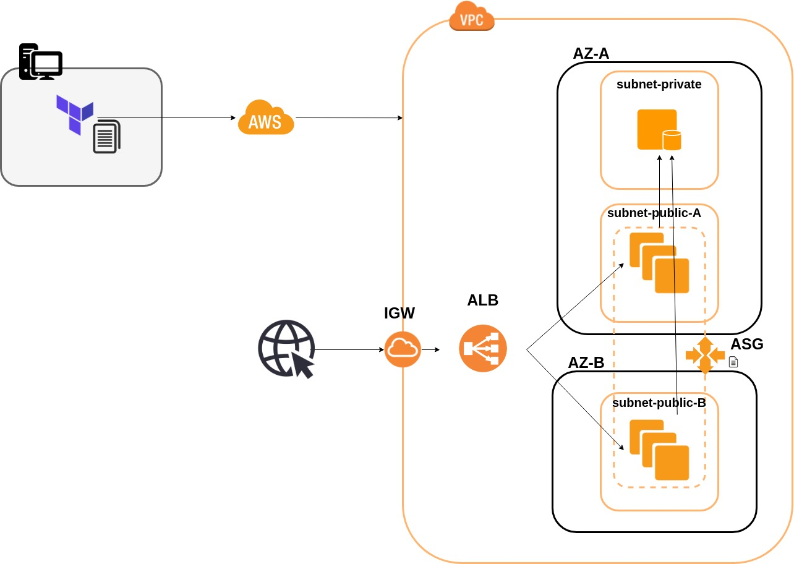

# Terraform High Availability Task

## Task
In this task, we have to create a highly available web application using IaC tool Terraform.

## Acceptance Criteria
- Terraform template to provision all resources
- Auto-Scaling Group created with an Application Load Balancer
- App fully working with Database

## Documentation
To have this project working on your own machine, you will need:
- Terraform installation
- AWS credentials (Root or IAM role)

After installing Terraform, make sure the AWS credentials are available as environment variables.
Then, at the main directory, run `terraform plan` and `terraform apply` to create the instances.

## Solution
In order to create a highly available application, an **Auto-Scaling-Group** will be used, with an **Application Load Balancer**.

Before implementing in Terraform, the ASG was implemented through the console, so that all the required components are noted.
Therefore, after completing the task with the AWS console, the following components were created:
- Launch template
- Application Launch Balancer
- Load Balancer Target Group
- Load Balancer Listener
- Auto Scaling Group

